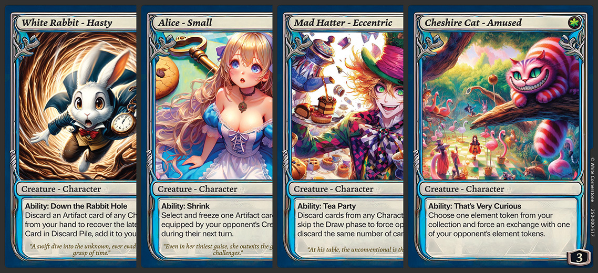

# Game Components

Welcome to **Alice: Cards of Wonder**. This player guide, available online, is your portal to understanding and navigating the game. The following components are included:

## Base Set

### Playing Cards (72 total)

   - **Creature Cards (16):** Includes characters such as Alice, the Mad Hatter, the White Rabbit, and the Cheshire Cat, each with unique abilities.
   - **Artifact Cards (20):** Equip Creatures with special items and skills for added powers.
   - **Action Cards (8):** Either single-use or ongoing cards for strategic gameplay twists.
   - **Environment Cards (20):** Alter the landscape of play, introducing various challenges and opportunities.
   - **Identity Cards (8):** Representing the key characters: Alice, the Mad Hatter, the White Rabbit, and the Cheshire Cat, 2 copies of each.

### Tokens
- **Gem Tokens (6):** 2 copies of Red, Green, and Purple gems, the primary objectives of the game.
- **Element Tokens (36):** Essential for refining gems, representing elements like Water, Wood, Fire, Earth, Metal, and Herbs, 6 copies of each.
- **Effect Tokens (8):** Placed on cards to indicate they have effects/abilities/actions applied, acting as tags/labels to show side effects.
- **Reap Tokens (12):** Placed on cards to indicate this creature is in reap state.

### Printed Player Guide
The printed player guide is extracted from the online version and serves as a quick start reference for new players. It provides essential rules and guidelines to get you started with **Alice: Cards of Wonder**. For the most updated and comprehensive information, please refer to the online player guide.

## Expansion Set

### Playing Cards (48 total)
- **Creature Cards (14)**
- **Artifact Cards (20)**
- **Action Cards (12)**
- **Identity Cards (2)** New character introduced: Queen of Hearts, 2 copies

## Online Player Guide
You are currently reading the online version of the player guide, which provides comprehensive rules, card descriptions, and gameplay strategies.

## Playmat 
A thematic, beautifully illustrated playmat is available for purchase separately. It enhances the playing experience and adds to the aesthetic appeal of the game.

:::info Info
The playmat is not required to play the game and is sold separately.
:::
